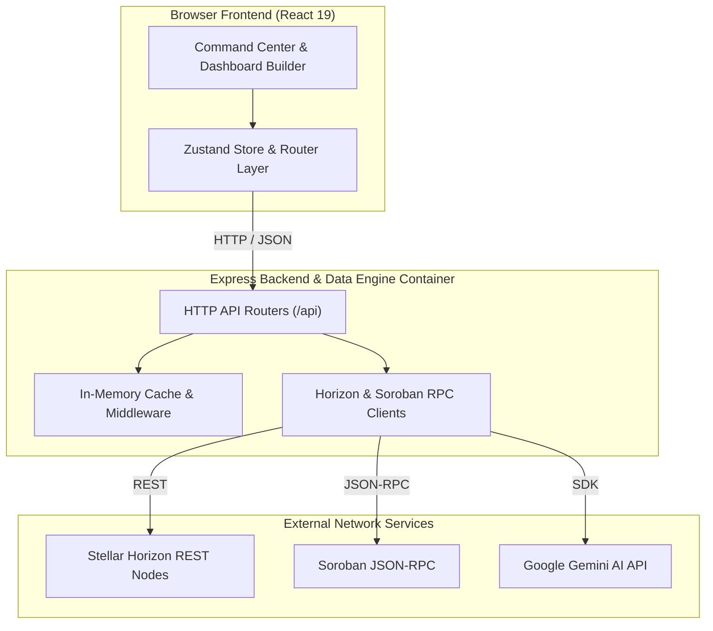

# Nolyvatix

[](LICENSE)
[](https://github.com/AnnieIj/nolyvatix)
[](https://github.com/AnnieIj/nolyvatix)
[](https://react.dev/)
[](https://www.typescriptlang.org/)
[](https://tailwindcss.com/)
[](https://stellar.org/)

**Nolyvatix** is an open-source Business Intelligence (BI), telemetry, and analytics platform built specifically for the **Stellar blockchain ecosystem** and **Soroban WASM smart contracts**.

It aggregates real-time Stellar Horizon REST events, ledger close metrics, payment corridor telemetry, liquidity pool stats, and Soroban JSON-RPC contract invocation data into customizable dashboards, AI-assisted insights, multi-channel alerts, and data exports.

---

## 💡 Why Nolyvatix?

Stellar ecosystem developers, liquidity providers, and network operators often need to stitch together raw RPC nodes, block explorers, and custom scripts to monitor network state. Nolyvatix unifies real-time ledger telemetry, customizable BI workspaces, WASM smart contract execution profiling, and Google Gemini AI assistance into a single open-source platform.

---

## ✨ Key Features

- **Real-Time Command Center**: Live ledger sequence listener, throughput (TPS) tracking, block close speeds, fee pool monitoring, and instant Mainnet/Testnet environment switching.
- **Enterprise Dashboard Builder**: Drag-and-drop 12-column grid workspace supporting custom KPI cards, time-series charts, workspace duplication, layout persistence, and entity pinning.
- **BI Reporting Engine**: Automated executive, technical, and compliance report generation with package exports in `JSON`, `CSV`, and `Markdown`.
- **Alert & Webhook Center**: Rule-based notification triggers (TPS drops, whale transfers >1M XLM, DEX volume surges, Soroban WASM contract errors) dispatched via Webhooks, Email, Slack, Discord, and Browser alerts.
- **Universal Search Intelligence**: Fast search matching Stellar public keys (`G...`), Soroban contracts (`C...`), transaction hashes, ledgers, assets, AMM liquidity pools, dashboards, and reports.
- **Multi-Workspace Hub & Collaboration**: Role-based access control (`owner`, `editor`, `viewer`), tokenized read-only share links, and bookmarked entity collections.
- **Unified Export Center**: Package Exporter supporting PDF, CSV, JSON, Markdown, PNG, and SVG vector chart downloads.
- **Gemini AI Copilot**: Natural language query engine powered by Google Gemini AI (`@google/genai`) for plain-English network telemetry queries, contract profiling, and automated chart generation.

---

## 🏛️ Architecture



---

## 🖼️ Screenshots

> _Placeholders: UI screenshots demonstrating the Command Center, Dashboard Builder, and Gemini AI Copilot will be added in upcoming releases._

| Command Center Telemetry | Drag-and-Drop Dashboard Builder |
| :---: | :---: |
|  |  |

| Gemini AI Copilot Chat | Alert & Webhook Center |
| :---: | :---: |
|  |  |

---

## 🛠️ Technology Stack

- **Frontend**: React 19, TypeScript 5.7, Tailwind CSS v4, Zustand, Lucide React, Recharts
- **Backend Engine**: Node.js v20+, Express.js, `@google/genai` (Gemini AI SDK)
- **Blockchain Integration**: `@stellar/stellar-sdk` (Horizon REST & Soroban JSON-RPC)
- **Testing & Tooling**: Node.js Native Test Runner (`node:test`), Vite, esbuild, TypeScript

---

## ⚙️ Environment Variables

Create a `.env` file in the root directory based on `.env.example`:

```env
# Required for Gemini AI Copilot
GEMINI_API_KEY="YOUR_GEMINI_API_KEY"

# Platform & Network Preferences
APP_URL="http://localhost:3000"
VITE_STELLAR_NETWORK="mainnet"
VITE_HORIZON_URL="https://horizon.stellar.org"
VITE_SOROBAN_RPC_URL="https://mainnet.soroban.stellar.org"

# Feature Flags
VITE_ENABLE_MOCK_DATA="false"
VITE_ENABLE_AI_COPILOT="true"
```

---

## 📥 Installation

1. **Clone the repository**:
   ```bash
   git clone https://github.com/AnnieIj/nolyvatix.git
   cd nolyvatix
   ```

2. **Install dependencies**:
   ```bash
   npm install
   ```

3. **Set up environment variables**:
   ```bash
   cp .env.example .env
   ```

---

## 🚀 Running the Project

### Development Mode
Start the full-stack Express & Vite dev server:
```bash
npm run dev
```
Open [http://localhost:3000](http://localhost:3000) in your browser.

### Production Build & Launch
Build the React bundle and server binary, then run:
```bash
npm run build
npm start
```

---

## 📂 Project Structure

```
nolyvatix/
├── src/
│   ├── components/       # UI design system, widgets, and layout panels
│   ├── server/           # Express server, data engine, clients, repositories & routes
│   ├── store/            # Zustand global application state
│   ├── types/            # TypeScript interface definitions
│   └── views/            # Main application pages and BI views
├── docs/                 # Architectural specifications and project documentation
├── server.ts             # Node.js Express server entry point
└── vite.config.ts        # Vite build configuration
```

---

## 📡 API Overview

Nolyvatix mounts a structured REST API under the `/api` prefix:

- **Network & Ledgers** (`/api/network`, `/api/ledgers`): Network health, Horizon/Soroban status, throughput (TPS), and ledger headers.
- **Transactions & Accounts** (`/api/transactions`, `/api/accounts`): Settlement history, operation logs, account balances, and trustlines.
- **Assets & Liquidity** (`/api/assets`, `/api/liquidity-pools`): Verified assets, orderbooks, DEX trade aggregations, and liquidity pool metrics.
- **Soroban Smart Contracts** (`/api/soroban`): WASM contract health, execution telemetry, invocations, and contract events.
- **AI & Universal Search** (`/api/ai`, `/api/search`): Gemini AI copilot chat, WASM gas profiling, and universal entity search.
- **Workspaces, Reports & Alerts** (`/api/workspaces`, `/api/reports`, `/api/alerts`): Workspace layout CRUD, shareable links, BI report exports, and alert rules.

---

## 🧪 Testing

Execute the test runner and code quality verification scripts:

```bash
# Run backend test suites (46 passing tests)
npm test

# Run full project verification (linting, tests, build)
npm run check
```

---

## 🚢 Deployment

For production deployments (PM2, Docker, Nginx reverse proxy setup), refer to the detailed [Deployment Guide](DEPLOYMENT.md).

---

## 🗺️ Roadmap

- [x] **Phase 1**: Real-time Command Center, Horizon SSE listener, Soroban RPC client, Gemini AI integration.
- [x] **Phase 2**: Dashboard Builder, BI Reporting, Enterprise Alerting, Workspace Hub, Multi-format Exporter.
- [ ] **Phase 3**: PostgreSQL/Redis state persistence, Helm/Kubernetes charts, OpenAPI Swagger UI.

See [ROADMAP.md](ROADMAP.md) for full details.

---

## 🤝 Contributing

Contributions, bug reports, and feature requests are welcome! Please read [CONTRIBUTING.md](CONTRIBUTING.md) and [CODE_OF_CONDUCT.md](CODE_OF_CONDUCT.md) before submitting pull requests.

---

## 📜 License

This project is licensed under the MIT License - see the [LICENSE](LICENSE) file for details.

---

## 👤 Author

**AnnieIj**
- GitHub: [@AnnieIj](https://github.com/AnnieIj)
