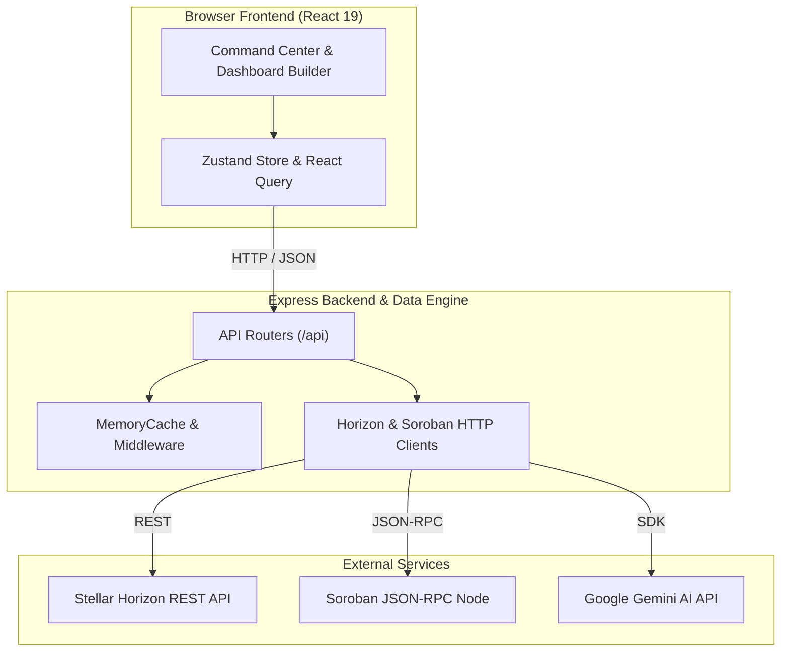

# Nolyvatix

[](LICENSE)
[](https://github.com/AnnieIj/nolyvatix)
[](https://github.com/AnnieIj/nolyvatix)
[](https://react.dev/)
[](https://www.typescriptlang.org/)
[](https://tailwindcss.com/)
[](https://stellar.org/)

**Nolyvatix** is an open-source Business Intelligence (BI), telemetry, and analytics platform built specifically for the **Stellar blockchain ecosystem** and **Soroban WASM smart contracts**.

It aggregates real-time Stellar Horizon REST events, ledger close metrics, payment corridor telemetry, liquidity pool stats, and Soroban JSON-RPC contract invocation data into customizable dashboards, AI-assisted insights, multi-channel alerts, and data exports.

---

## 💡 Why Nolyvatix?

Stellar ecosystem developers, liquidity providers, and network operators often need to stitch together raw RPC nodes, block explorers, and custom scripts to monitor network state. Nolyvatix unifies real-time ledger telemetry, customizable BI workspaces, WASM smart contract execution profiling, and Google Gemini AI assistance into a single open-source platform.

---

## ✨ Key Features

- **Real-Time Command Center**: Live ledger sequence tracking, throughput (TPS) monitoring, block close speeds, fee pool metrics, and environment switching between Stellar Mainnet and Testnet.
- **Enterprise Dashboard Builder**: Drag-and-drop 12-column grid workspace supporting custom KPI cards, time-series charts, layout persistence, widget duplication, and entity pinning.
- **BI Reporting Engine**: Automated executive, technical, and compliance report generation with exports in `JSON`, `CSV`, and `Markdown` packages.
- **Alert & Webhook Center**: Rule-based notification triggers (TPS drops, whale transfers >1M XLM, DEX volume surges, Soroban contract errors) dispatched via Webhooks, Email, Slack, Discord, and Browser notifications.
- **Universal Search Intelligence**: Query Stellar public keys (`G...`), Soroban contract IDs (`C...`), transaction hashes, ledger sequences, assets, AMM liquidity pools, dashboards, reports, and alert rules.
- **Multi-Workspace Hub & Collaboration**: Workspace creation and management with role-based permissions (`owner`, `editor`, `viewer`), tokenized read-only share URLs, and entity bookmarking.
- **Unified Export Center**: Multi-format exporter supporting PDF, CSV, JSON, Markdown, PNG, and SVG chart downloads.
- **Gemini AI Copilot**: Natural language query engine powered by Google Gemini AI (`@google/genai`) for network telemetry insights, contract execution profiling, and automated chart generation.

---

## 🏛️ Architecture

Nolyvatix operates as a single-process full-stack node application:

- **Frontend**: Single-page application built with React 19, Zustand for client state management, and Tailwind CSS v4 for styling.
- **Backend & Data Engine**: Express.js server providing API route handlers, in-memory caching (`MemoryCache`), and clients for external communication.
- **Blockchain Integrations**: Custom `HorizonClient` and `SorobanClient` issuing HTTP REST and JSON-RPC 2.0 requests directly to Stellar Horizon nodes and Soroban RPC endpoints.
- **AI Integration**: Server-side `AiService` interacting with the Google Gemini API using `@google/genai`.



---

## 🖼️ Screenshots

> Screenshots and product demonstrations will be added as the project evolves.

---

## 🛠️ Technology Stack

- **Frontend**: React 19, TypeScript 7, Tailwind CSS v4, Zustand 5, Lucide React, Recharts 3, Motion 12, TanStack React Query 5
- **Backend Engine**: Node.js (>=20.0.0), Express.js 4, `@google/genai` (Gemini AI SDK)
- **Blockchain Protocol**: Direct REST (`HorizonClient`) and JSON-RPC 2.0 (`SorobanClient`) HTTP clients for Stellar and Soroban
- **Build & Development**: Vite 6, esbuild, `tsx`, Node.js native test runner

---

## ⚙️ Environment Variables

Copy `.env.example` to `.env` and configure the required variables:

| Variable | Description | Required | Default / Example |
| :--- | :--- | :---: | :--- |
| `GEMINI_API_KEY` | Google Gemini API key for AI Copilot features | Optional | `YOUR_GEMINI_API_KEY` |
| `APP_URL` | Base host URL of the deployed application | Optional | `http://localhost:3000` |
| `VITE_APP_TITLE` | Application branding title | Optional | `Nolyvatix - Stellar Blockchain BI Platform` |
| `VITE_STELLAR_NETWORK` | Stellar network target (`mainnet`, `testnet`, `futurenet`) | Optional | `mainnet` |
| `VITE_HORIZON_URL` | Stellar Horizon REST endpoint | Optional | `https://horizon.stellar.org` |
| `VITE_SOROBAN_RPC_URL` | Soroban JSON-RPC 2.0 endpoint | Optional | `https://soroban-rpc.mainnet.stellar.org` |
| `VITE_ENABLE_MOCK_DATA` | Toggle mock telemetry fallback | Optional | `false` |
| `VITE_ENABLE_AI_COPILOT` | Toggle AI Copilot features in the UI | Optional | `true` |

---

## 📥 Installation & Setup

1. **Clone the repository**:
   ```bash
   git clone https://github.com/AnnieIj/nolyvatix.git
   cd nolyvatix
   ```

2. **Install dependencies**:
   ```bash
   npm install
   ```

3. **Configure environment variables**:
   ```bash
   cp .env.example .env
   ```

---

## 🚀 Running the Project

### Development Mode
Start the development server (runs Express server and Vite on port `3000`):
```bash
npm run dev
```
Access the application at `http://localhost:3000`.

### Production Build & Execution
Build the static bundle and Node.js server, then start the production runtime:
```bash
npm run build
npm start
```

---

## 📂 Project Structure

```
nolyvatix/
├── src/
│   ├── components/       # UI design system, page sections, and layout elements
│   ├── server/           # Express server, data engine, clients, repositories & route handlers
│   ├── store/            # Zustand global state management
│   ├── types/            # TypeScript type definitions and interfaces
│   └── views/            # Main application views and BI dashboards
├── docs/                 # Product requirement documents and architecture specs
├── server.ts             # Node.js Express server entry point
├── package.json          # Project scripts and dependency declarations
└── vite.config.ts        # Vite frontend bundler configuration
```

---

## 📡 API Overview

The Express backend exposes endpoints under the `/api` route prefix:

- `/api/network`: Network health, Horizon/Soroban status, and throughput (TPS) telemetry.
- `/api/ledgers`: Closed ledger sequence history and header details.
- `/api/transactions`: Transaction settlement logs and operation counts.
- `/api/accounts`: Stellar public key balance and trustline inspection.
- `/api/assets`: Asset verification, orderbook metrics, and DEX trade aggregations.
- `/api/liquidity-pools`: AMM pool reserve ratios, TVL, and APY rates.
- `/api/operations`: Network operation logs and payment corridor telemetry.
- `/api/soroban`: WASM smart contract health, execution events, and invocation stats.
- `/api/ai`: Gemini AI copilot chat, contract gas profiling, and natural language query processing.
- `/api/dashboards`: Workspace layout CRUD, widget configuration, and pinning.
- `/api/reports`: BI report generation and data package exports.
- `/api/alerts`: Notification trigger configuration, event log history, and acknowledgment.
- `/api/workspaces`: Multi-workspace CRUD, share link generation, and search history.
- `/api/search`: Universal entity search engine.
- `/api/settings`: Application preferences and refresh intervals.

---

## 🧪 Testing & Quality Assurance

Execute backend unit tests and verification checks:

```bash
# Run unit test suites via Node.js native test runner
npm test

# Run full project validation (TypeScript type check, unit tests, production build)
npm run check

# Run TypeScript type check only
npm run lint
```

---

## 🚢 Deployment

Detailed instructions for running Nolyvatix in staging and production environments (PM2 process manager, Docker containerization, and Nginx reverse proxy configuration) can be found in [DEPLOYMENT.md](DEPLOYMENT.md).

---

## 🗺️ Roadmap

### Implemented (v1.0.0)
- Real-time Command Center with live ledger monitoring and network switcher.
- Drag-and-drop Dashboard Builder with layout persistence and custom KPI widgets.
- BI Reporting Engine supporting executive digest generation and multi-format exports.
- Multi-channel Alerting with threshold triggers (TPS drops, whale transfers, contract errors).
- Universal Search Engine and Multi-Workspace Collaboration Hub.
- Gemini AI Copilot for natural language telemetry queries and contract gas profiling.

### Planned
- PostgreSQL & Redis persistent database storage adapters.
- Kubernetes Helm chart deployment definitions.
- Interactive OpenAPI / Swagger UI documentation at `/api/docs`.

For complete details, see [ROADMAP.md](ROADMAP.md).

---

## 🤝 Contributing & Governance

Contributions are welcome! Please review the project guidelines before opening an issue or pull request:

- [CONTRIBUTING.md](CONTRIBUTING.md) — Contribution guidelines and development workflow.
- [MAINTAINER.md](MAINTAINER.md) — Maintenance protocols and governance rules.
- [SECURITY.md](SECURITY.md) — Vulnerability disclosure process.
- [CODE_OF_CONDUCT.md](CODE_OF_CONDUCT.md) — Community code of conduct.

---

## 📜 License

This project is licensed under the **MIT License**. See the [LICENSE](LICENSE) file for details.

---

## 👤 Author

**AnnieIj**  
GitHub: [@AnnieIj](https://github.com/AnnieIj)
